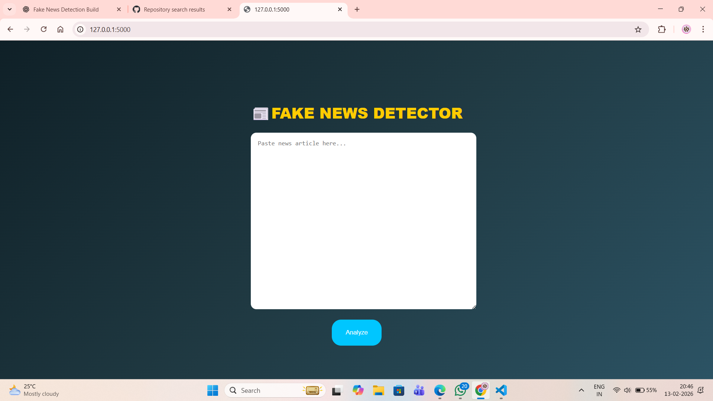
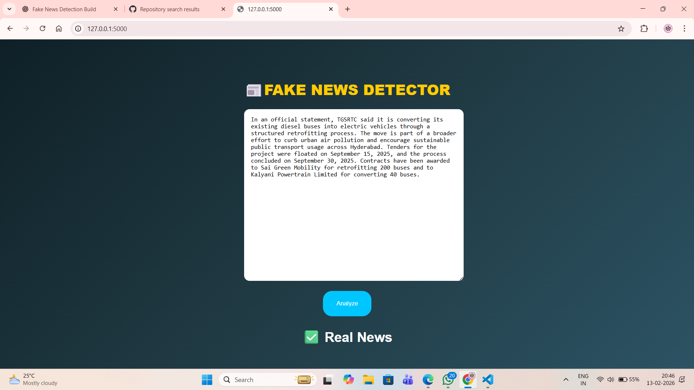
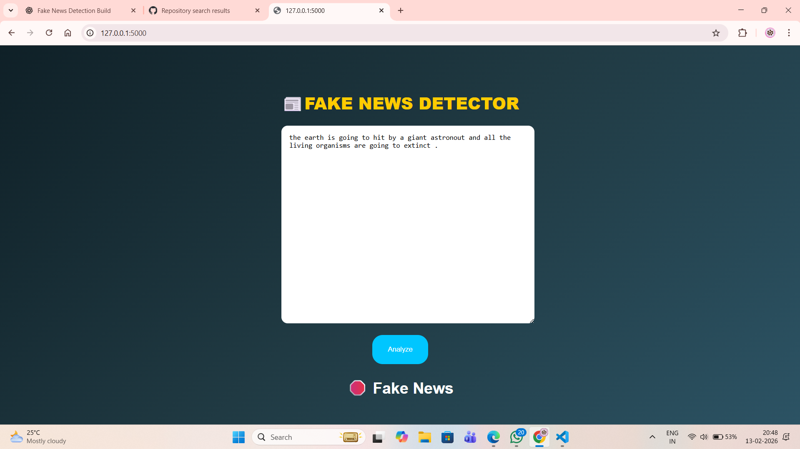

# 📰 Fake News Detector

A **Machine Learning powered web application** that detects whether a news article is **Real or Fake** using **Natural Language Processing (NLP)** and **Logistic Regression**.

---

# 🚀 Project Overview

This project uses:

- 🔤 **TF-IDF Vectorization** for feature extraction  
- 📊 **Logistic Regression** for classification  
- 🌐 **Flask** for web application development  
- 🤖 **Scikit-learn** for machine learning  

Users can input any news content, and the system predicts whether it is:

- 🛑 **Fake News**
- ✅ **Real News**

---

# 🧠 Machine Learning Workflow

1. 🧹 Data preprocessing (cleaning + lowercasing)
2. 📰 Combining news title and text
3. 🔎 TF-IDF feature extraction
4. 📂 Train-test split
5. 🤖 Logistic Regression model training

---

# 🖼️ Application Screenshots

## 🏠 **Home Page**

  

---

## ✅ **Real News Prediction**

  

---

## 🛑 **Fake News Prediction**

  

---

# 📊 Dataset

The dataset consists of two files:

- 📁 **Fake.csv**
- 📁 **True.csv**

Each record contains:

- Title  
- Text  
- Label (0 = Fake, 1 = Real)  

NOTE: As the dataset is very huge for the git . Download it from the kaggle 
  ( https://www.kaggle.com/datasets/clmentbisaillon/fake-and-real-news-dataset )

---

# 🛠️ Tech Stack

- Python  
- Flask  
- Pandas  
- Scikit-learn  
- HTML/CSS  

---

# 📂 Project Structure

fake-news-detector/
|
├──news_dataset.csv
| └── True.csv
| └── Fake.csv
├── app.py
├── train_model.py
├── templates/
│ └── index.html
├── static/
│ └── style.css
├── images/
│ ├── home.png
│ ├── real_news.png
│ └── fake_news.png
├── requirements.txt
├── .gitignore
└── README.md

# ⚙️ Installation & Setup

## 1️⃣ Clone the Repository
git clone https://github.com/nancharlaanyothri/fake-news-detector.git
cd fake-news-detector

## 2️⃣ Create Virtual Environment
python -m venv venv
venv\Scripts\activate   

## 3️⃣ Install Dependencies
pip install -r requirements.txt

## 4️⃣ Train the Model
Place the dataset inside:

news_dataset.csv/
    ├── Fake.csv
    └── True.csv
Then run:
python train_model.py

## 5️⃣ Run the Application
python app.py
Open your browser and go to:
http://127.0.0.1:5000/
